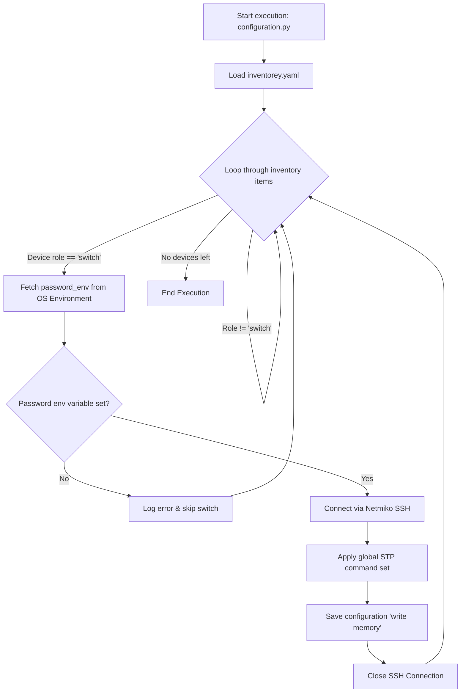

# Complete STP Automation Setup Guide

This document combines the inventory definition, automation logic, workflow flowchart, and execution steps for configuring Spanning Tree Protocol (STP) across 3 switches using **Python**, **Netmiko**, and **YAML**.

---

## 1. Project Directory Layout

```text
LAB2-STP/
├── inventorey.yaml     # Device inventory
├── configuration.py    # Automation execution script
├── Guideline.md        # Combined guide and documentation
└── venv/               # Virtual environment
```

---

## 2. Workflow Architecture Flowchart



---

## 3. Inventory Configuration (`inventorey.yaml`)

Save this content inside `inventorey.yaml`:

```yaml
- hostname: Switch1
  host: 10.10.10.2
  device_type: cisco_ios
  username: admin
  password_env: SWITCH_PASSWORD
  role: switch

- hostname: Switch2
  host: 10.10.10.3
  device_type: cisco_ios
  username: admin
  password_env: SWITCH_PASSWORD
  role: switch

- hostname: Switch3
  host: 10.10.10.4
  device_type: cisco_ios
  username: admin
  password_env: SWITCH_PASSWORD
  role: switch
```

---

## 4. Automation Python Script (`configuration.py`)

Save this content inside `configuration.py`:

```python
import os
import yaml
from netmiko import ConnectHandler

def load_inventory(filepath="inventorey.yaml"):
    """Reads and parses the YAML inventory file."""
    with open(filepath, "r") as f:
        return yaml.safe_load(f)

# Global STP commands for brand-new switches
STP_COMMANDS = [
    "spanning-tree mode rapid-pvst",
    "spanning-tree portfast default",
    "spanning-tree portfast bpduguard default"
]

def main():
    inventory = load_inventory()
    
    for device in inventory:
        # Filter strictly for switches
        if device.get("role") != "switch":
            continue

        hostname = device.get("hostname")
        env_var = device.get("password_env")
        password = os.environ.get(env_var) if env_var else None

        if not password:
            print(f"[SKIP] Password environment variable '{env_var}' not set for {hostname}.")
            continue

        netmiko_device = {
            "device_type": device.get("device_type", "cisco_ios"),
            "host": device.get("host"),
            "username": device.get("username"),
            "password": password,
        }

        print(f"[*] Connecting to {hostname} ({device.get('host')})...")
        try:
            connection = ConnectHandler(**netmiko_device)
            output = connection.send_config_set(STP_COMMANDS)
            print(f"--- Configuration Output: {hostname} ---")
            print(output)
            
            connection.save_config()
            connection.disconnect()
            print(f"[+] STP configured successfully on {hostname}.\n")
        except Exception as e:
            print(f"[-] Connection failed for {hostname}: {e}\n")

if __name__ == "__main__":
    main()
```

---

## 5. Execution Steps

### Step 1: Install Python Dependencies
Run this command inside your terminal:
```bash
pip install netmiko pyyaml
```

### Step 2: Set Switch Password Environment Variable
Set your secret switch password in the environment session matching `password_env`:

* **Linux / macOS:**
  ```bash
  export SWITCH_PASSWORD="your_switch_password"
  ```
* **Windows (PowerShell):**
  ```powershell
  $env:SWITCH_PASSWORD="your_switch_password"
  ```

### Step 3: Run Automation
```bash
python configuration.py
```

---

## 6. Verification Commands

To confirm that Rapid PVST and default edge port guards are active on the switches, execute these CLI commands on any switch:

```text
Switch# show spanning-tree summary
Switch# show running-config | section spanning-tree
```